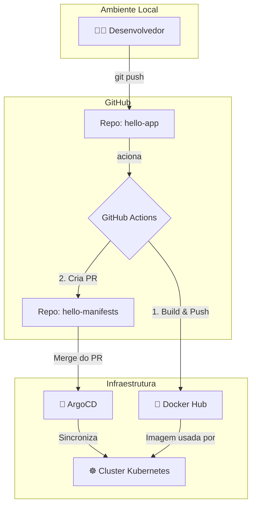

# CI-CD-com-o-GitHub-Actions---PB-JUN-Compass

Este repositório contém o código-fonte e a configuração de CI/CD para o projeto hello-app, uma aplicação simples desenvolvida com FastAPI. O objetivo deste projeto é demonstrar um ciclo completo de automação de desenvolvimento, build, deploy e execução, utilizando as melhores práticas de GitOps.

A pipeline de CI/CD está configurada para:

- Realizar o build da imagem Docker da aplicação.

- Publicar a imagem no Docker Hub.

- Atualizar automaticamente o repositório de manifestos Kubernetes (hello-manifests) para refletir a nova versão da imagem, que por sua vez, será sincronizada pelo ArgoCD.

Arquitetura do Projeto
A solução utiliza uma abordagem com dois repositórios para separar o código da aplicação das configurações de deploy, seguindo os princípios do GitOps.

Repositório da Aplicação [hello-app](https://github.com/felipemgilioli/hello-app): Contém o código da aplicação FastAPI, o Dockerfile e o workflow do GitHub Actions responsável pelo CI.

Repositório de Manifestos [hello-manifests](https://github.com/felipemgilioli/hello-manifests): Contém os manifestos Kubernetes (Deployment e Service) que o ArgoCD utiliza como "fonte da verdade" para o deploy no cluster.

## 🏛️ Diagrama da Arquitetura
Aqui você pode adicionar um diagrama simples que ilustra o fluxo do processo de CI/CD.


Exemplo de fluxo: Desenvolvedor commita -> GitHub Actions (build & push) -> PR no repositório de manifestos -> Merge do PR -> ArgoCD sincroniza com o cluster K8s.

## 🛠️ Tecnologias Utilizadas
Linguagem: Python 3

Framework: FastAPI

Conteinerização: Docker

Orquestração: Kubernetes (via Rancher Desktop)

CI/CD: GitHub Actions

Entrega Contínua (CD) & GitOps: ArgoCD

Registry de Imagens: Docker Hub

## ✅ Pré-requisitos
Antes de começar, garanta que você tenha os seguintes pré-requisitos instalados e configurados:

Conta no GitHub (com o repositório hello-manifests já criado).

Conta no Docker Hub com um token de acesso gerado.

Rancher Desktop com o Kubernetes habilitado.

kubectl configurado para se conectar ao cluster local (kubectl get nodes).

ArgoCD instalado no cluster local.

Git instalado.

Python 3 e Docker instalados na sua máquina.

## 🚀 Configuração do Projeto
Siga os passos abaixo para replicar o ambiente.

Etapa 1 – Repositórios
#Repositório da Aplicação (hello-app):
Este é o repositório, contém:

main.py: A aplicação FastAPI.

Dockerfile: As instruções para construir a imagem Docker.

.github/workflows/ci.yml: O workflow de CI/CD.

#Repositório de Manifestos (hello-manifests):
Você precisará criar este repositório. Ele conterá:

deployment.yaml: Define como a aplicação será executada no Kubernetes.

service.yaml: Expõe a aplicação para ser acessada.

Você pode encontrar os arquivos de manifesto neste link: felipemgilioli/hello-manifests.

Etapa 2 – Configurando os Segredos no GitHub
Para que o GitHub Actions possa se autenticar no Docker Hub e fazer alterações no repositório de manifestos, você precisa configurar os seguintes segredos no repositório hello-app (Vá em Settings > Secrets and variables > Actions):

DOCKER_USERNAME: Seu nome de usuário do Docker Hub.

DOCKER_PASSWORD: Seu token de acesso do Docker Hub.

SSH_PRIVATE_KEY: A chave SSH privada que tem permissão de escrita no seu repositório hello-manifests.

⚠️ **Importante: Nunca exponha suas chaves ou senhas diretamente nos arquivos de workflow. Sempre utilize os Secrets do GitHub.**

Etapa 3 – Configurando o ArgoCD
Acesse a interface do ArgoCD.

Crie um novo aplicativo, conectando-o ao seu repositório hello-manifests.

Configure o caminho para os arquivos de manifesto e o namespace de destino no seu cluster Kubernetes.

[COLE A IMAGEM DA CONFIGURAÇÃO DO APP NO ARGOCD AQUI]

Etapa 4 – Testando o Fluxo de CI/CD
Faça uma alteração no arquivo main.py (por exemplo, mude a mensagem "Hello World").

Faça o commit e o push das alterações para a branch main do repositório hello-app.

Aguarde a execução do workflow do GitHub Actions.

Verifique se um Pull Request foi criado automaticamente no repositório hello-manifests.

Faça o merge desse Pull Request.

Aguarde o ArgoCD detectar a mudança e sincronizar a aplicação no cluster.

## 📊 Resultados e Evidências
Abaixo estão as evidências do funcionamento da pipeline de CI/CD.

Build e Push da Imagem no Docker Hub


Atualização Automática dos Manifestos:

-

Sincronização no ArgoCD
A imagem abaixo mostra o status da aplicação como Healthy e Synced no ArgoCD após a pipeline ser executada.


Verificação dos Pods no Kubernetes
Comando: kubectl get pods


Acesso à Aplicação
Para acessar a aplicação localmente, utilize o port-forward:

```Bash

kubectl port-forward svc/<nome-do-servico> 8080:80
```
Em seguida, acesse http://localhost:8080 no navegador ou via curl.


